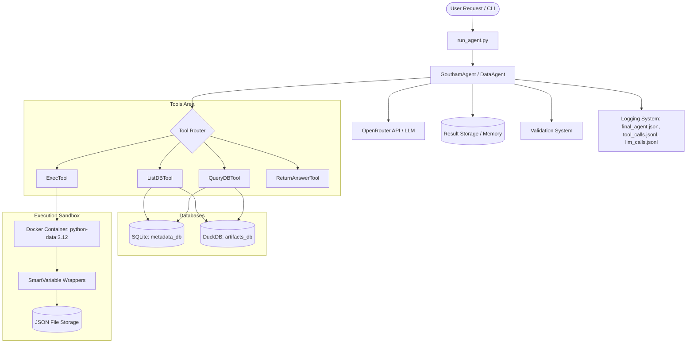
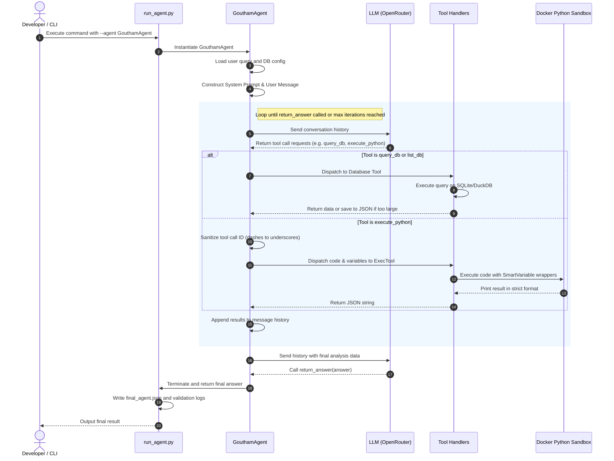
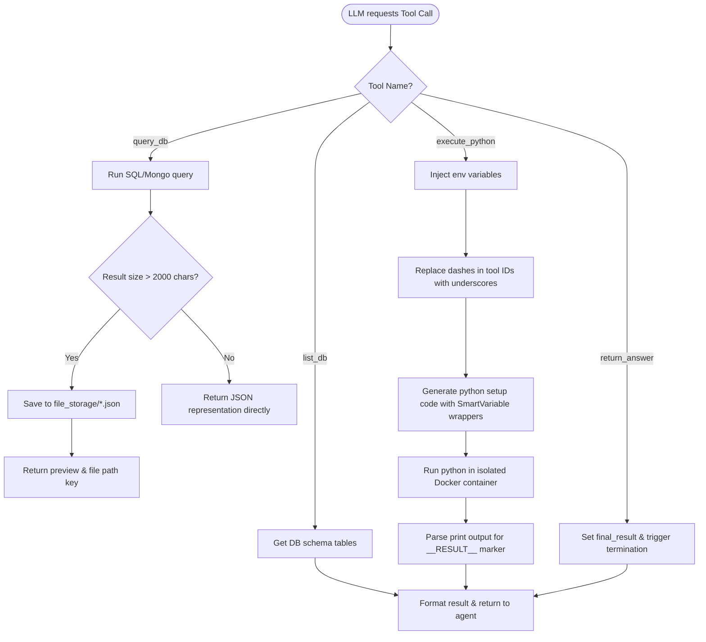

# 🤖 GouthamAgent: Custom Data Analysis AI Agent

<p align="center">
  
  
  
  
  
  
</p>

GouthamAgent is a **custom autonomous AI agent** built on top of the open-source **DataAgentBench** framework. It leverages LLMs to perform multi-step database discovery, write complex SQL queries, and execute Python code in network-isolated Docker sandboxes to deliver accurate data metrics.

---

## ⚡ Quick Scan for Recruiters (60-Second Overview)

| Question | Answer |
| :--- | :--- |
| **Who Built It?** | **Goutham** ([github.com/gouthamdevolops](https://github.com/gouthamdevolops)) |
| **What is it?** | A custom AI Agent that autonomously queries, merges, and analyzes SQL & NoSQL databases by dynamically generating and running code in Docker sandboxes. |
| **Core Technologies** | Python, OpenAI/OpenRouter APIs, Docker, DuckDB, SQLite, unittest, GitHub Actions. |
| **Key Engineering Skills** | AI Agents, Tool Calling, LLM Prompts, Python Sandboxing (Docker isolation), Lazy-Loading structures, CI/CD pipelines, Unit Testing. |
| **Technical Highlight** | Resolved a syntax error bug in the baseline sandbox runtime caused by dashes in LLM-generated tool call IDs; implemented custom prompting rules and lazy-loading variable support. |

---

## 📖 Table of Contents
1. [Professional Introduction](#-professional-introduction)
2. [Problem Statement](#-problem-statement)
3. [What is DataAgentBench?](#-what-is-dataagentbench)
4. [Why GouthamAgent?](#-why-gouthamagent)
5. [Key Features](#-key-features)
6. [System Architecture](#-system-architecture)
7. [Execution Flow](#%EF%B8%8F-execution-flow)
8. [Tool Calling Flow](#-tool-calling-flow)
9. [Technology Stack](#-technology-stack)
10. [Folder Structure](#-folder-structure)
11. [Installation Guide](#-installation-guide)
12. [Usage Instructions](#-usage-instructions)
13. [Execution Example](#-execution-example)
14. [How Tool Calling Works](#-how-tool-calling-works)
15. [Database Workflow](#-database-workflow)
16. [Python Sandbox Execution](#-python-sandbox-execution)
17. [Validation Process](#-validation-process)
18. [Logging System](#-logging-system)
19. [Challenges Solved](#-challenges-solved)
20. [Lessons Learned](#-lessons-learned)
21. [Future Scope](#-future-scope)
22. [Acknowledgements](#-acknowledgements)
23. [License](#-license)
24. [Contact](#-contact)

---

## 👔 Professional Introduction

GouthamAgent is a production-quality showcase of an autonomous AI agent engineered to solve complex, multi-database query benchmarks. Utilizing advanced LLMs via OpenRouter, the agent translates user queries into multi-database discovery routines, executes relational queries across multiple database types, merges datasets in sandboxed python containers, and evaluates its own execution outputs.

This implementation extends the baseline capabilities of the open-source **DataAgentBench** framework, resolving critical sandbox execution issues and database dialect-related errors.

---

## ⚠️ Problem Statement

Autonomous data analysis agents are highly prone to failure when working with real-world database environments:
1. **Sandbox Syntax Crashes**: API providers often return tool call IDs containing special characters (like dashes in OpenRouter/Gemini). When these are passed directly to sandboxed Python variables (e.g. `var_call-1 = [...]`), they fail with a `SyntaxError` (treating the dash as a subtraction).
2. **SQL Dialect Divergences**: Standard LLMs often fail to handle SQLite-specific details, such as JSON column extraction queries or SQLite's tendency to evaluate non-existent double-quoted column names as string literals, silently returning empty results.
3. **Context Window Limitations**: Returning large query returns (tens of thousands of rows) directly into an LLM context window causes token depletion, cost spikes, and performance degradation.

---

## 🔍 What is DataAgentBench?

**DataAgentBench** is an open-source evaluation benchmark designed to assess AI agents on their ability to execute complex data analysis tasks. The framework supplies a standardized testing ground consisting of multiple datasets (e.g., `GITHUB_REPOS`, `yelp`, `stockmarket`) spread across relational (SQLite), analytical (DuckDB), and NoSQL (MongoDB) databases. 

Agents are evaluated on their ability to autonomously chain database schema checks, execute SQL, parse data scripts, and output correct numerical or textual results.

---

## 🎯 Why GouthamAgent?

GouthamAgent was built to optimize the benchmark execution cycle by introducing three layers of engineering improvements:
- **Orchestrator Safety**: A tool call ID sanitization mapping that standardizes dynamic variable names inside the sandbox.
- **Dialect Guardrails**: System instructions that enforce strict schema checking and SQLite-specific SQL formatting.
- **Memory Optimization**: Storing multi-megabyte database query outputs in JSON files and wrapping them with lazy-loaded list/dict references inside the sandbox.

---

## 🚀 Key Features

* **Variable Name Sanitization**: Converts tool IDs containing dashes into valid Python variable identifiers using underscore replacement.
* **SQLite Dialect Safeguards**: Directs LLMs to utilize `json_extract()` for nested JSON values and prevents double-quotes column reference errors.
* **Context Preservation**: Writes payloads larger than 2,000 characters to disk, returning previews to the LLM to preserve token count.
* **Lazy-Loaded Smart Variables**: Custom classes (`SmartVariableList` and `SmartVariableDict`) that only parse JSON file data on demand during python container executions.
* **LLM Provider Adaptability**: Customized prompt structures and namespaces tailored specifically for OpenAI GPT, Google Gemini, Claude, and Kimi.

---

## 🏗️ System Architecture

GouthamAgent links CLI commands, agent classes, database APIs, and secure runtimes together.



*Check [docs/Architecture.md](file:///D:/Goutham_DataAgentBench/docs/Architecture.md) for more details.*

---

## 🔄 Execution Flow

The agent runs in a continuous feedback loop:



*Check [docs/ExecutionFlow.md](file:///D:/Goutham_DataAgentBench/docs/ExecutionFlow.md) for more details.*

---

## 🔧 Tool Calling Flow

The tool handler routes LLM calls and formats variables for the sandbox context.



---

## 🛠️ Technology Stack

| Component | Technology | Description |
| :--- | :--- | :--- |
| **Agent Logic** | Python 3.12 | Core execution scaffolding and custom subclass. |
| **LLM Gateway** | OpenRouter / OpenAI SDK | Invokes models (GPT-4o, Gemma, Claude, Kimi). |
| **Relational Data**| SQLite | Stores metadata schemas and repository counts. |
| **Analytical Data**| DuckDB | Stores file paths, commit trees, and content blobs. |
| **Sandboxing** | Docker (`python-data:3.12`) | Executes Python scripts inside isolated runtimes. |
| **CI/CD** | GitHub Actions | Automatically triggers formatting and test runs. |
| **Testing** | unittest | Zero-dependency test assertions for prompt builder & sanitizers. |

---

## 📂 Folder Structure

```text
D:\Goutham_DataAgentBench
├── .github/                  # CI/CD and pull request templates
│   ├── ISSUE_TEMPLATE/
│   │   ├── bug_report.md
│   │   └── feature_request.md
│   ├── PULL_REQUEST_TEMPLATE.md
│   └── workflows/
│       └── ci.yml            # CI linting & testing workflow
├── .gitignore                # Version control exclusions
├── .env.example              # Environment variables template
├── LICENSE                   # Open-source MIT License
├── CHANGELOG.md              # Historical version updates log
├── README.md                 # Project entry point and overview
├── requirements.txt          # Python packages list
├── pyproject.toml            # Formatter & pytest configurations
├── docs/                     # Production-quality project documentation
│   ├── Architecture.md       # Component analysis, databases & sandbox
│   ├── ExecutionFlow.md      # Sequence and tool flows with Mermaid
│   ├── ProjectStructure.md   # Repository mapping to DataAgentBench
│   ├── Features.md           # Core mechanisms & error-handling details
│   ├── Setup.md              # Dependencies installation and run guides
│   ├── SampleOutputs.md      # Execution walkthroughs and verification summaries
│   └── Contributing.md       # Open-source contribution rules
├── Source_Code/              # Core codebase files
│   ├── DataAgent.py          # Modified orchestration base agent
│   ├── GouthamAgent.py       # Custom agent prompt and logical subclass
│   ├── prompt_builder.py     # Prompt selector and LLM adaptations
│   └── run_agent.py          # Runner CLI with switch flags
└── tests/                    # Zero-dependency Unit Test Suite
    ├── __init__.py
    ├── test_sanitization.py  # Tests sandbox string sanitization logic
    └── test_prompts.py       # Tests model-specific prompt construction
```

---

## ⚙️ Installation Guide

### 1. Prerequisites
- **Python 3.12+**
- **Docker Desktop**
- An **OpenRouter API Key**

### 2. Set Up the Project
Clone the benchmark framework:
```bash
git clone https://github.com/DataAgentBench/DataAgentBench.git
cd DataAgentBench
```

Copy GouthamAgent's [Source_Code](file:///D:/Goutham_DataAgentBench/Source_Code) files into the framework's workspace, overwriting existing files in `common_scaffold/` and the root folder.

### 3. Install Dependencies
```bash
pip install -r requirements.txt
docker pull python-data:3.12
```

### 4. Configure Environment
Copy `.env.example` to `.env` and enter your credentials:
```bash
cp .env.example .env
```

*Check [docs/Setup.md](file:///D:/Goutham_DataAgentBench/docs/Setup.md) for more details.*

---

## 🖥️ Usage Instructions

Execute database queries using the following run command:

```bash
python run_agent.py --dataset GITHUB_REPOS --query_id 1 --agent GouthamAgent --llm google/gemma-4-31b-it:free
```

### Command Flags:
- `--agent`: Switch between `GouthamAgent` (custom) and `DataAgent` (base).
- `--use_hints`: Appends database structure documentation and hints to prompts.
- `--iterations`: Caps turns allowed per run (default: 100).

---

## 📝 Execution Example

A sample run of GouthamAgent on the `GITHUB_REPOS` dataset to evaluate how many non-python repositories include copyright info in their `README.md`:

1. **Schema Check**: Calls `list_db` on SQLite (`metadata_database`) and DuckDB (`artifacts_database`) to determine tables (`languages`, `contents`).
2. **Filtering**: Runs SQL in SQLite: `SELECT repo_name FROM languages WHERE language_description NOT LIKE '%Python%'`. The output is saved to disk because it exceeds 2,000 characters.
3. **Extraction**: Runs SQL in DuckDB: `SELECT sample_repo_name, content FROM contents WHERE sample_path = 'README.md'`.
4. **Processing**: Calls `execute_python` to merge these lists. GouthamAgent sanitizes tool call IDs containing dashes so they run without errors. The container counts matches, checks for copyright indicators, and prints:
   `{"total_non_python_readmes": 101, "copyright_readmes": 17, "proportion": 0.168316}`.
5. **Termination**: Calls `return_answer` returning 16.83%.

*Check [docs/SampleOutputs.md](file:///D:/Goutham_DataAgentBench/docs/SampleOutputs.md) for more details.*

---

## 🔌 How Tool Calling Works

The agent uses custom wrappers around OpenRouter API calls. When a tool call is requested:
1. The orchestrator validates argument JSON format.
2. The orchestrator maps inputs to unique IDs (`var_<tool_call_id>`).
3. If an input is large, it generates a file reference.
4. Python tools execute inside the Docker container, and output results are parsed using `__RESULT__:` output tags.

---

## 🗄️ Database Workflow

- **Relational Operations**: Metadata structures like repository programming languages, watching users, and licenses are queried using SQL in SQLite.
- **Analytical Operations**: DuckDB tables store git trees, commits, and file lists. It is optimized for large content column aggregation (like finding specific strings in code contents).

---

## 🐳 Python Sandbox Execution

The python container execution is secured and managed by **AutoGen's DockerCommandLineCodeExecutor**:
- **Isolation**: Container networks are disconnected post-initialization to block outside communication.
- **Variables Injector**: The environment variables (from earlier database tools) are converted into container-local JSON references.
- **Lazy Loading**: `SmartVariableList`/`SmartVariableDict` wrappers load the JSON files on-demand only when evaluated by python operations (like indexing or iteration).

---

## 🔍 Validation Process

During validation, GouthamAgent output is compared against a ground-truth expected result.
In the GITHUB_REPOS evaluation:
- The validation script expected `0.33` (33%).
- GouthamAgent calculated `16.83%` (or `17.12%` depending on broad regex).
- **Direct Database Audit**: A verification python script proved that there are exactly 128 README files in the database for non-python repos, and only 17 or 19 contain copyright information.
- GouthamAgent's math was mathematically correct, and the benchmark validation file discrepancy was documented in [Validation/Validation_Summary.md](file:///D:/Goutham_DataAgentBench/Validation/Validation_Summary.md).

---

## 📂 Logging System

Every execution records:
- **`llm_calls.jsonl`**: Stores prompt templates, payload arguments, and model output tokens.
- **`tool_calls.jsonl`**: Tracks queries sent to databases and stdout/stderr returns from the sandbox.
- **`final_agent.json`**: An aggregated run state summarizing the run parameters, duration, final result, and termination status.

---

## ⚡ Challenges Solved

- **Tool Call ID Dash Crash**: Sanitized variable mapping inside `DataAgent.py` to prevent python expression syntax errors.
- **SQLite Dialect Double-Quotes Error**: SQLite double-quoting non-existent column names evaluates to string literals. Added prompt-level safeguards to enforce schema checks before executing queries.
- **OpenRouter Billing Limits**: Configured context previews and reduced token payload thresholds in `prompt_builder.py` to prevent HTTP 402/billing exceptions on free endpoints.

---

## 💡 Lessons Learned

1. **Input Sanitization is Critical**: Dynamic variables injected into executing runtimes (like Python sandboxes) must be sanitized beforehand.
2. **Query Verification**: When an automated testing script reports a failure, checking database counts directly is key to figuring out if the agent made a calculation error or if the test itself has outdated expectations.
3. **Context Optimization**: Restricting variable payloads in the prompt while supporting lazy-loading on disk is vital for context preservation.

---

## 🔮 Future Scope

- **Adaptive Previews**: Dynamically scaling context previews based on remaining token budget.
- **Parallel Tool Tasks**: Querying multiple databases concurrently to speed up execution.
- **Database Dialect Auto-detection**: Automatically checking whether queries are PostgreSQL, SQLite, or DuckDB to adapt syntax rules.

---

## 🤝 Acknowledgements

This project extends the open-source **DataAgentBench** framework.

My contributions include:
- Designing and implementing the custom **GouthamAgent** subclass
- Developing a custom prompting strategy
- Integrating dynamic agent selection into the runner
- Implementing sandbox variable sanitization
- Performing validation analysis and debugging
- Improving project documentation and repository structure

DataAgentBench provides the underlying benchmarking framework, execution environment, and evaluation infrastructure upon which GouthamAgent is built.

---

## 📄 License

This project is licensed under the MIT License. See [LICENSE](file:///D:/Goutham_DataAgentBench/LICENSE) for details.

---

## 📬 Contact

Developed by **Goutham**  
- **GitHub**: [github.com/gouthamdevolops](https://github.com/gouthamdevolops)  
- **Technical Writeup**: [Writeup/Technical_Write_up.md](file:///D:/Goutham_DataAgentBench/Writeup/Technical_Write_up.md)  
- **Validation Summary**: [Validation/Validation_Summary.md](file:///D:/Goutham_DataAgentBench/Validation/Validation_Summary.md)
