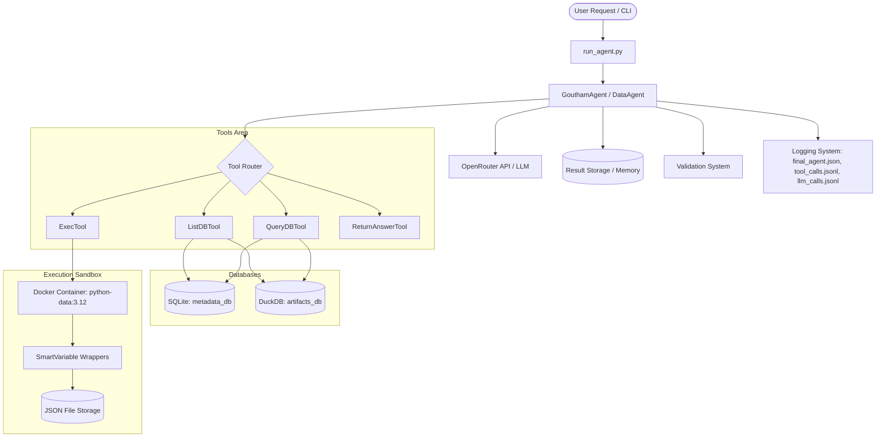

# System Architecture

This document describes the system architecture of **GouthamAgent**, a custom implementation built on top of the open-source **DataAgentBench** framework. GouthamAgent is specifically designed to perform robust, multi-step data analysis on complex multi-database query benchmarks.

---

## Overall Architecture

The architecture of GouthamAgent consists of the CLI/Runner, the Agent core (managing memory and LLM calls), tool adapters, multiple databases, and an isolated Docker-based Python sandbox for calculations.

---

## Core Components

### 1. Runner ([run_agent.py](file:///D:/Goutham_DataAgentBench/Source_Code/run_agent.py))
The entry point of the application. It parses command-line arguments to:
- Select the dataset and target query.
- Choose which agent to initialize (`DataAgent` or the custom `GouthamAgent`).
- Set the maximum allowed iterations and enable or disable database hints.
- Read database descriptions and configs to bootstrap the agent context.

### 2. Agent Core ([GouthamAgent.py](file:///D:/Goutham_DataAgentBench/Source_Code/GouthamAgent.py) & [DataAgent.py](file:///D:/Goutham_DataAgentBench/Source_Code/DataAgent.py))
- **GouthamAgent** inherits from the base `DataAgent`. It overrides the core system prompts with highly specific directives optimized for SQLite dialect details (like JSON queries), column schemas, and python formatting rules.
- **DataAgent** handles the orchestration logic. It interacts with OpenRouter's LLM APIs, routes tool calls, populates intermediate result storage, and saves log outputs.

### 3. Database Integration
The framework provides two primary database engines exposed to the agent:
- **SQLite Database (`metadata_database`)**: Contains tabular relational metadata (e.g., repository programming languages, licenses, and stars). SQLite requires dialect-specific querying, such as JSON extraction functions (`json_extract`) to parse columns containing nested JSON.
- **DuckDB Database (`artifacts_database`)**: An analytical database containing file blobs, contents (such as `README.md` contents), commit histories, and file trees.

### 4. Python Sandbox Execution ([ExecTool.py](file:///D:/Projects/DataAgentBench/common_scaffold/tools/ExecTool.py))
To perform calculations, data merges, and formatting, the agent calls the `execute_python` tool. Code execution is isolated via:
- **Docker-isolated Sandbox**: An isolated Docker container (`python-data:3.12`) with network access stripped post-startup for security.
- **Smart Variable Wrappers**: If query results are too large, they are written to host files. Inside the sandbox, these are mapped to `SmartVariableList` and `SmartVariableDict` objects. These classes lazily load JSON file contents only when properties or methods (like `len`, iteration, or indexing) are accessed. This allows the sandbox to reference multi-megabyte datasets without blowing up memory limits.
