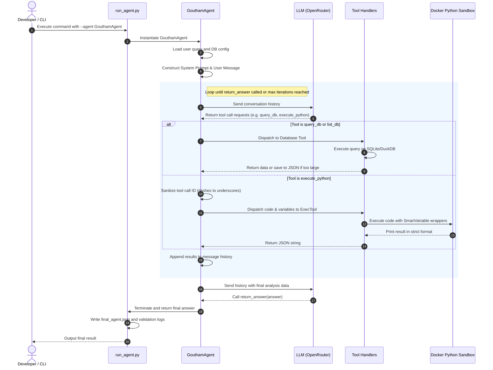
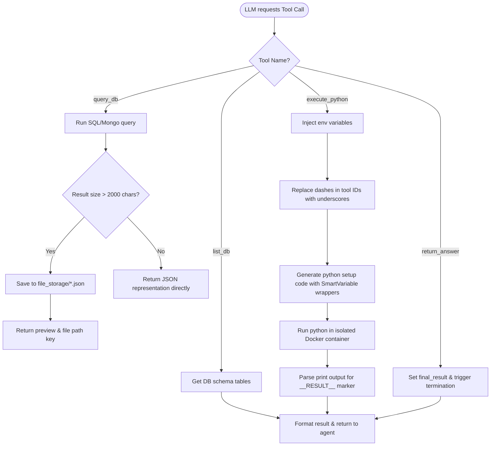

# Execution Flow & Tool Calling

This document explains the runtime execution loop of **GouthamAgent** and describes how tools are requested, executed, and fed back into the agent context.

---

## Agent Execution Loop

The execution follows a multi-step agentic sequence. Below is a diagram illustrating the flow from user input to final validation.

---

## Tool Calling Flow

When the LLM issues a tool call, GouthamAgent parses and routes the request. Large database queries and Python script variables require special handling to fit within context limits.

### Detailed Tool Specifications

1. **`list_db`**:
   - Lists all table or collection names in a target database.
   - Used during early iterations to learn the database schema structure before crafting SQL/Mongo queries.

2. **`query_db`**:
   - Executes queries on the database (SQLite or DuckDB).
   - If the serialized query output exceeds `PREVIEW_LENGTH` (2,000 characters), it writes the full payload as a JSON file in `file_storage/` and sends a preview alongside the file path back to the agent.

3. **`execute_python`**:
   - Executes custom Python code to transform and merge tables.
   - Code runs inside the isolated Docker sandbox environment.
   - Variables referencing large file paths are wrapped in `SmartVariableList`/`SmartVariableDict` objects, preventing memory overflow.

4. **`return_answer`**:
   - Terminates the agent loop by supplying the final plain-text response back to the user.
